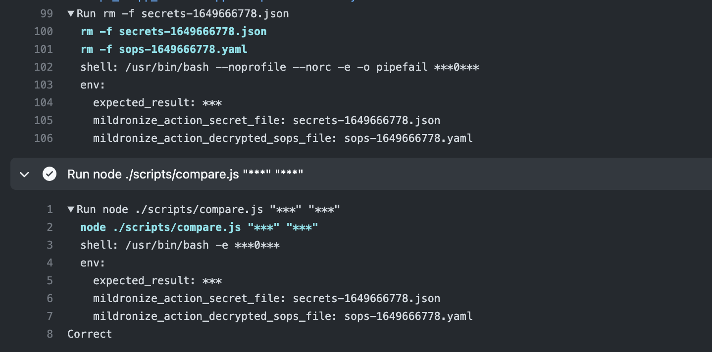

# actions-get-secret-sops
GitHub Action get secret with specific key from encrypted SOPS yaml file

## Build Status (GitHub Actions)

| Encryption Method | Status |
|-------------------|--------|
| Age               | [](https://github.com/mildronize/actions-get-secret-sops/actions/workflows/test-age.yaml)   |
| Azure Key Vault   | [](https://github.com/mildronize/actions-get-secret-sops/actions/workflows/test-azure-key-vault.yaml)  |

## Features
- Support Azure Key Vault, Age
- Hide secret from SOPS yaml file when read it



## Usage

### Using Age

Set the secrets name of Age Private Key:

```yml
steps:
  - uses: actions/checkout@v3
  - uses: mildronize/actions-get-secret-sops@v1
    id: sops
    with:
      path: "examples/data.age-enc.yaml"                     
      property-path: ".scope_a.app_service.app1"              
      decrypting-key: ${{ secrets.Age_SOPS_github_action }}                 
      sops-version: '3.7.2'
  - run: echo "${{ steps.sops.outputs.secret }}"
```

### Using Azure Key Vault

When you create Azure Credential with:

```bash
az ad sp create-for-rbac -n "my-service-principal-name" --role Contributor --scopes /subscriptions/xxxxxxx
```

it will generate json, the structure of secret:

```json
{
  "appId": "<some-uuid>",
  "displayName": "my-service-principal-name",
  "password": "<some-uuid>",
  "tenant": "<tenant-id>"
}
```

Set the secrets name `Azure_Credential` or name what you want.

```yaml
steps:
  - uses: actions/checkout@v3
  - uses: mildronize/actions-get-secret-sops/azure@v1
    id: sops
    with:
      path: "azure.enc.yaml"                          # Encrypted SOPS yaml path
      property-path: ".property"                      # yq/jq expression syntax for getting a particular value
      decrypting-key: ${{ secrets.Azure_Credential }} # A credential using to decrypt a Encrypted SOPS yaml file
      sops-version: '3.7.2'

  - run: echo "${{ steps.sops.outputs.secret }}"
```

# SOPS 101

Checkout the main repo for full documentation: https://github.com/mozilla/sops

## Encrypt using Age

Install age

```
brew install age
```

Generate Age Key

```
age-keygen -o key.txt
```

The contain in file `key.txt` :

```
# created: 2022-04-11T15:36:32+07:00
# public key: age1js5yl37ghup68pzf8f2kutf6xtuwc4m6lpha0llgmcup93q3sp9qtfwvr8
AGE-SECRET-KEY-15YXVYTPWNT4UF3KY05K27LZN2SAT83SJKX7UH4MXQEQAWRWPFNYSDHK860
```

**DO NOT PUBLISH AGE SECRET KEY** (This is for example in this repo only)

```
sops --encrypt --age age1js5yl37ghup68pzf8f2kutf6xtuwc4m6lpha0llgmcup93q3sp9qtfwvr8 examples/data.yaml > examples/data.age-enc.yaml
```

Set GitHub Action Secret with Age Secret key

## Encrypt with Azure Key Vault

```bash
az ad sp create-for-rbac -n "sp_sops_github_action" --role Contributor --scopes /subscriptions/[Subscription ID]/resourceGroups/[resource_Group_name]/providers/Microsoft.KeyVault/vaults/[vault_name]

{
  "appId": "<some-uuid>",
  "displayName": "my-keyvault-sp",
  "name": "http://my-keyvault-sp",
  "password": "<some-uuid>",
  "tenant": "<tenant-id>"
}

export AZURE_CLIENT_ID="appId"
export AZURE_TENANT_ID="tenant"
export AZURE_CLIENT_SECRET="password"
```

```bash
az account set --subscription "XXXX"
az group create --name rg-common --location "Central US"
# Create a Vault, a key, and give the service principal access:
az keyvault create --name "kv-github-action" --resource-group rg-common --location "Central US"

az keyvault key create --name "sops-key" --vault-name "kv-github-action" --protection software --ops encrypt decrypt

az keyvault set-policy --name "kv-github-action" --resource-group "rg-common" --spn $AZURE_CLIENT_ID \
        --key-permissions encrypt decrypt

# Read the key id:
az keyvault key show --name "sops-key" --vault-name "kv-github-action" --query key.kid

https://sops.vault.azure.net/keys/sops-key/some-string

# Encrypt
sops --encrypt --azure-kv https://sops.vault.azure.net/keys/sops-key/some-string test.yaml > test.enc.yaml
# Decrypt
sops --decrypt test.enc.yaml
```